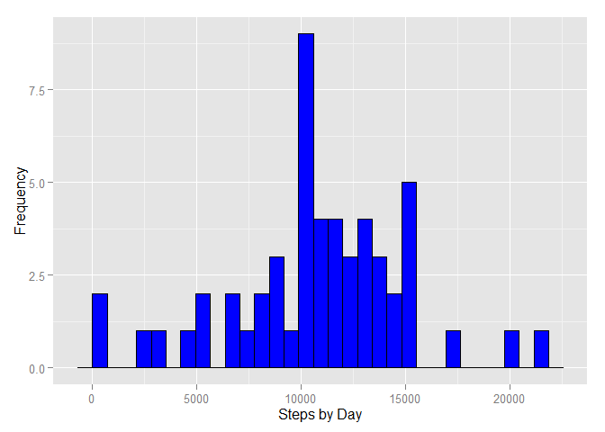
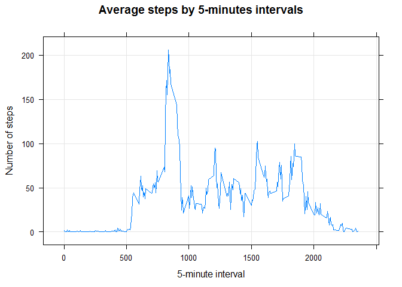
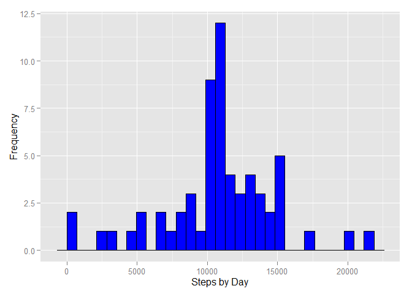
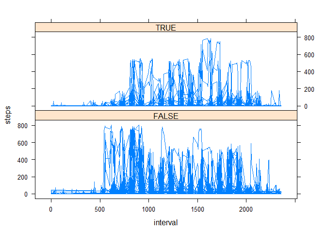

# Reproducible Research: Peer Assessment 1


```r
## Loading and preprocessing the data

library(plyr)
library(timeDate)
```

```
## Warning: package 'timeDate' was built under R version 3.2.3
```

```r
library(chron)
```

```
## Warning: package 'chron' was built under R version 3.2.3
```

```r
library(ggplot2)
```

```
## Warning: package 'ggplot2' was built under R version 3.2.3
```

```r
library(lattice)
#options(echo=TRUE)
#setwd("~/selfdev/Coursera/Course 5 - Reproducible Research/Week 1")
#Download the file and unzip it if it does not exist(Check for the constituent file)
if(!file.exists("activity.csv")) {
  file <- tempfile()
  download.file("https://d396qusza40orc.cloudfront.net/repdata%2Fdata%2Factivity.zip",file)
  unzip(file) # unzip the file
  unlink(file) # remove the temporary file
}
```


```r
#Read data and ignore nulls(NA values)
fitnessData = read.csv(file="activity.csv",colClasses =  c("integer", "character", "character"))
fitnessData$date<-as.Date(fitnessData$date,format="%Y-%m-%d" ) #Convert dates from string to date
weekEnd = (is.weekend(fitnessData$date))  #create vector with weekend indicator
fitnessData[,"weekend"]<-as.factor(weekEnd) # add weekend as a factor to original data
fitnessData$interval=as.numeric(fitnessData$interval)
nonNullfdata = na.omit(fitnessData) #Create a separate set of non-NA values

## What is mean total number of steps taken per day?

aggFitnessData = aggregate(nonNullfdata$steps,list(nonNullfdata$date), sum)
rename(aggFitnessData,c("Group.1" = "Date", "x"="Steps"))
```

```
##          Date Steps
## 1  2012-10-02   126
## 2  2012-10-03 11352
## 3  2012-10-04 12116
## 4  2012-10-05 13294
## 5  2012-10-06 15420
## 6  2012-10-07 11015
## 7  2012-10-09 12811
## 8  2012-10-10  9900
## 9  2012-10-11 10304
## 10 2012-10-12 17382
## 11 2012-10-13 12426
## 12 2012-10-14 15098
## 13 2012-10-15 10139
## 14 2012-10-16 15084
## 15 2012-10-17 13452
## 16 2012-10-18 10056
## 17 2012-10-19 11829
## 18 2012-10-20 10395
## 19 2012-10-21  8821
## 20 2012-10-22 13460
## 21 2012-10-23  8918
## 22 2012-10-24  8355
## 23 2012-10-25  2492
## 24 2012-10-26  6778
## 25 2012-10-27 10119
## 26 2012-10-28 11458
## 27 2012-10-29  5018
## 28 2012-10-30  9819
## 29 2012-10-31 15414
## 30 2012-11-02 10600
## 31 2012-11-03 10571
## 32 2012-11-05 10439
## 33 2012-11-06  8334
## 34 2012-11-07 12883
## 35 2012-11-08  3219
## 36 2012-11-11 12608
## 37 2012-11-12 10765
## 38 2012-11-13  7336
## 39 2012-11-15    41
## 40 2012-11-16  5441
## 41 2012-11-17 14339
## 42 2012-11-18 15110
## 43 2012-11-19  8841
## 44 2012-11-20  4472
## 45 2012-11-21 12787
## 46 2012-11-22 20427
## 47 2012-11-23 21194
## 48 2012-11-24 14478
## 49 2012-11-25 11834
## 50 2012-11-26 11162
## 51 2012-11-27 13646
## 52 2012-11-28 10183
## 53 2012-11-29  7047
```

```r
names(aggFitnessData)<-c("Date","Steps")


qplot(aggFitnessData$Steps, geom="histogram", xlab = "Steps by Day", ylab = "Frequency",col=I("black"),fill=I("blue"),bins=50)
```

```
## stat_bin: binwidth defaulted to range/30. Use 'binwidth = x' to adjust this.
```

 

```r
meanSteps = mean(aggFitnessData$Steps)
medianSteps = median(aggFitnessData$Steps)

meanstr = sprintf("The mean number of steps per day = %f",meanSteps)
medianstr = sprintf("The median number of steps per day = %f",medianSteps)

print(meanstr)
```

```
## [1] "The mean number of steps per day = 10766.188679"
```

```r
print(medianstr)
```

```
## [1] "The median number of steps per day = 10765.000000"
```

```r
## What is the average daily activity pattern?
meanByInterval <- aggregate(nonNullfdata$steps,list(nonNullfdata$interval), mean) 
names(meanByInterval)<-c("Interval","MeanSteps")
xyplot(MeanSteps ~ Interval, data=meanByInterval, type="l", grid=TRUE, ylab="Number of steps", xlab="5-minute interval", main="Average steps by 5-minutes intervals")
```

 

```r
maxSteps = max(meanByInterval$MeanSteps)
maxIndex=which(meanByInterval$MeanSteps==maxSteps)
maxinterval = meanByInterval$Interval[maxIndex]
maxstr= sprintf("The interval in which max number of steps occured is %g", maxinterval)
print(maxstr)
```

```
## [1] "The interval in which max number of steps occured is 835"
```

```r
## Imputing missing values

totalNA = nrow(fitnessData) - nrow(nonNullfdata)
NAstr= sprintf("The number of rows with null values is %g", totalNA)
print(NAstr)
```

```
## [1] "The number of rows with null values is 2304"
```

```r
normalisedData<-fitnessData

for (i in 1:nrow(normalisedData)){
  if (is.na(normalisedData$steps[i])){
      value <- meanByInterval$MeanSteps[which(normalisedData$interval[i] == meanByInterval$Interval)]
      normalisedData$steps[i] = value
    }
}

##What is mean total number of steps taken per day?
aggnFitnessData = aggregate(normalisedData$steps,list(normalisedData$date), sum)
rename(aggnFitnessData,c("Group.1" = "Date", "x"="Steps"))
```

```
##          Date    Steps
## 1  2012-10-01 10766.19
## 2  2012-10-02   126.00
## 3  2012-10-03 11352.00
## 4  2012-10-04 12116.00
## 5  2012-10-05 13294.00
## 6  2012-10-06 15420.00
## 7  2012-10-07 11015.00
## 8  2012-10-08 10766.19
## 9  2012-10-09 12811.00
## 10 2012-10-10  9900.00
## 11 2012-10-11 10304.00
## 12 2012-10-12 17382.00
## 13 2012-10-13 12426.00
## 14 2012-10-14 15098.00
## 15 2012-10-15 10139.00
## 16 2012-10-16 15084.00
## 17 2012-10-17 13452.00
## 18 2012-10-18 10056.00
## 19 2012-10-19 11829.00
## 20 2012-10-20 10395.00
## 21 2012-10-21  8821.00
## 22 2012-10-22 13460.00
## 23 2012-10-23  8918.00
## 24 2012-10-24  8355.00
## 25 2012-10-25  2492.00
## 26 2012-10-26  6778.00
## 27 2012-10-27 10119.00
## 28 2012-10-28 11458.00
## 29 2012-10-29  5018.00
## 30 2012-10-30  9819.00
## 31 2012-10-31 15414.00
## 32 2012-11-01 10766.19
## 33 2012-11-02 10600.00
## 34 2012-11-03 10571.00
## 35 2012-11-04 10766.19
## 36 2012-11-05 10439.00
## 37 2012-11-06  8334.00
## 38 2012-11-07 12883.00
## 39 2012-11-08  3219.00
## 40 2012-11-09 10766.19
## 41 2012-11-10 10766.19
## 42 2012-11-11 12608.00
## 43 2012-11-12 10765.00
## 44 2012-11-13  7336.00
## 45 2012-11-14 10766.19
## 46 2012-11-15    41.00
## 47 2012-11-16  5441.00
## 48 2012-11-17 14339.00
## 49 2012-11-18 15110.00
## 50 2012-11-19  8841.00
## 51 2012-11-20  4472.00
## 52 2012-11-21 12787.00
## 53 2012-11-22 20427.00
## 54 2012-11-23 21194.00
## 55 2012-11-24 14478.00
## 56 2012-11-25 11834.00
## 57 2012-11-26 11162.00
## 58 2012-11-27 13646.00
## 59 2012-11-28 10183.00
## 60 2012-11-29  7047.00
## 61 2012-11-30 10766.19
```

```r
names(aggnFitnessData)<-c("Date","Steps")
meannSteps = mean(aggnFitnessData$Steps)
mediannSteps = median(aggnFitnessData$Steps)

meannstr = sprintf("The mean number of steps per day = %f",meannSteps)
mediannstr = sprintf("The median number of steps per day = %f",mediannSteps)

print(meannstr)
```

```
## [1] "The mean number of steps per day = 10766.188679"
```

```r
print(mediannstr)
```

```
## [1] "The median number of steps per day = 10766.188679"
```

```r
qplot(aggnFitnessData$Steps, geom="histogram", xlab = "Steps by Day", ylab = "Frequency",col=I("black"),fill=I("blue"),bins=50)
```

```
## stat_bin: binwidth defaulted to range/30. Use 'binwidth = x' to adjust this.
```

 

```r
## Are there differences in activity patterns between weekdays and weekends?
xyplot(steps~interval|weekend, data=normalisedData, type='l', layout=c(1, 2))
```

 

